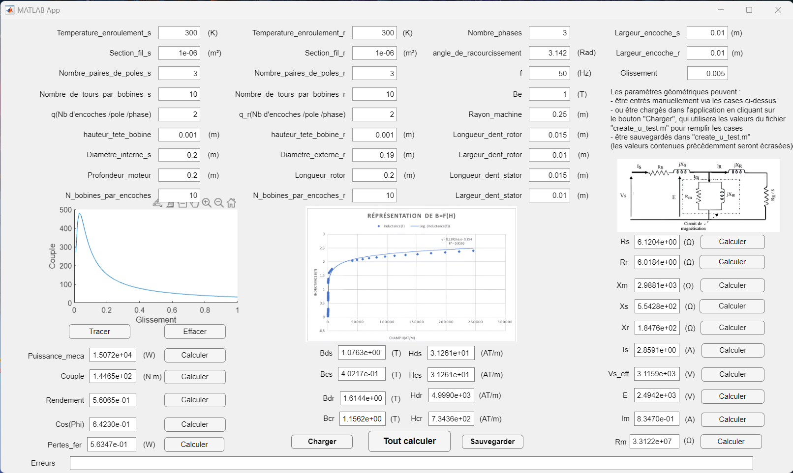
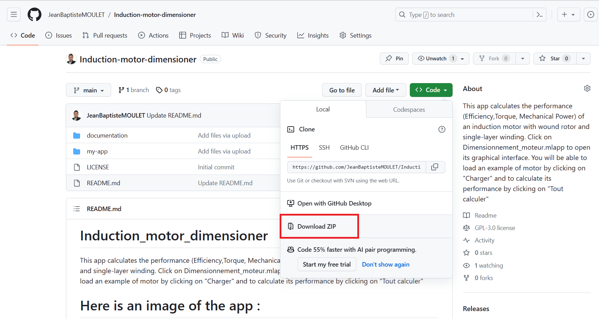
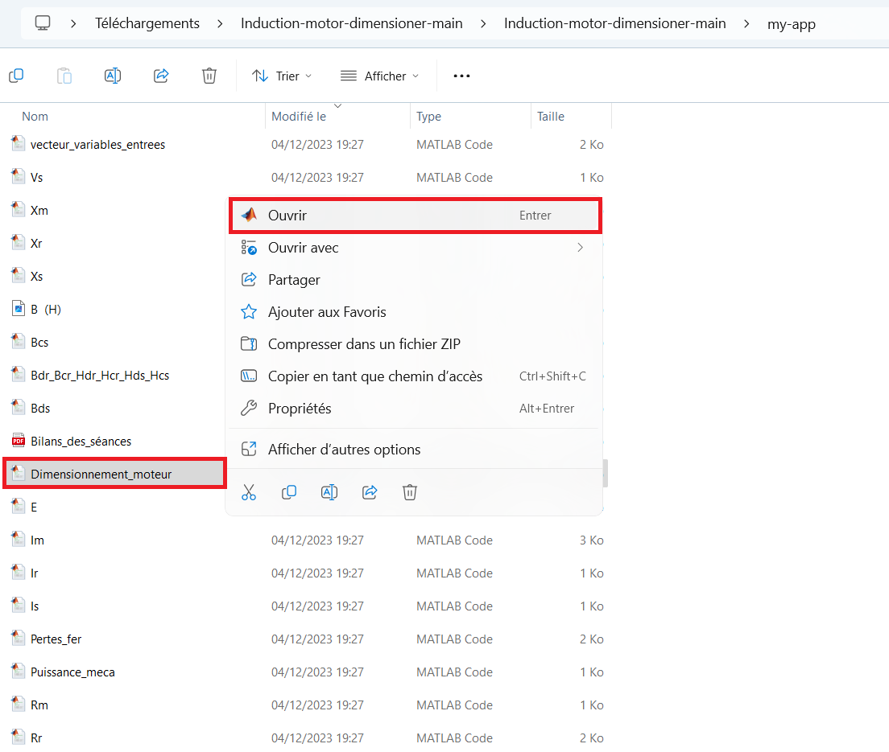

# Induction_motor_dimensioner
This app calculates the performance (Efficiency,Torque, Mechanical Power) of an induction motor with wound rotor and single-layer winding. Click on #Dimensionnement_moteur.mlapp# to open its graphical interface. You will be able to load an example of motor by clicking on "Charger" and to calculate its performance by clicking on "Tout calculer"
# Here is an image of the app :

# The app require all the .m files in order to run  :

# Once the files are extracted you can clic on "Open" from the file manager :

